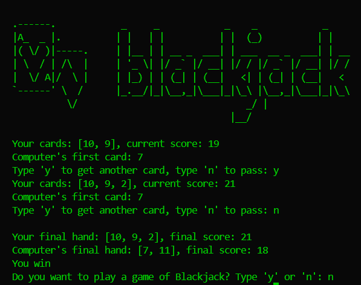

## **🃏 Day 11/100 - Blackjack Game in Python**
### *A simple console-based Blackjack game 🎴*



### **📌 Overview**
Welcome to **Day 11** of my **#HackThePython100** journey! Today, I built a **Blackjack** game using Python. This project helped me practice:
- Functions & loops
- Conditionals & user input handling
- Randomization in games

---

### **🛠 Features**
✔️ Fully playable **Blackjack** game  
✔️ Randomized **card dealing**  
✔️ **Ace handling** (11 becomes 1 if necessary)  
✔️ Computer follows **Blackjack rules**  
✔️ ASCII art logo for style 🎨  
✔️ Option to **replay** the game  

---

### **🚀 How to Run**
1. **Clone the repository**  
   ```sh
   git clone https://github.com/official-imvoiid/HackThePython100.git
   cd HackThePython100/Day11
   ```
2. **Run the game**  
   ```sh
   python Day11.py
   ```

---

### **📂 Project Files**
- **`Day11.py`** → Main game logic  
- **`art.py`** → ASCII logo  
- **`BlackJack.png`** → Game screenshot  

---

### **📢 What I Learned**
✅ Using **functions** for better code organization  
✅ Implementing **randomization** for card dealing  
✅ Handling **user input & loops** in interactive programs  
✅ Applying **conditionals** to manage game flow  

---

### **🌟 Support & Contributions**
🚀 If you like this project, **star it on GitHub**!   
🐍 Feel free to **fork and contribute** with improvements!  

---
💻 **Keep hacking & keep coding!**  
📅 **Day 11 complete – onto the next challenge!** 🔥  
