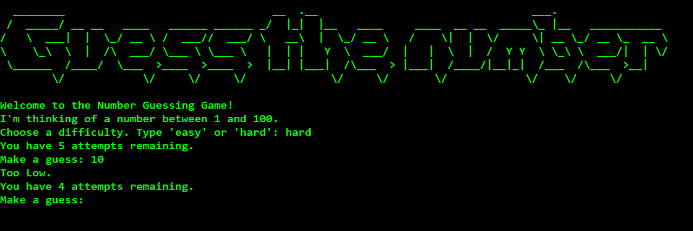

### 📌 **README.md**
```md
# 🎯 Day 12 - Number Guessing Game 🎯

Welcome to **Day 12** of *HackThePython100*! This project is a simple **Number Guessing Game** built in Python. The user must guess a randomly generated number within a set number of attempts. The game provides feedback on whether the guess is too high or too low.

---

## 🛠 **Features**
✔️ Random number generation (1 - 100).  
✔️ Two difficulty levels: **Easy** (10 attempts) & **Hard** (5 attempts).  
✔️ Feedback on every guess: *Too High* / *Too Low*.  
✔️ ASCII Art Logo for a stylish look.  
✔️ Fully interactive command-line gameplay.  

---

## 📜 **How to Play**
1. Run the script:
   ```sh
   python Day12.py
   ```
2. The game will prompt:
   ```
   Welcome to the Number Guessing Game!
   I'm thinking of a number between 1 and 100.
   Choose a difficulty. Type 'easy' or 'hard': 
   ```
3. Enter **'easy'** or **'hard'** to set the difficulty.
4. Start guessing! The game will tell you if your guess is *Too High* or *Too Low*.
5. If you guess the correct number, you win! Otherwise, the game ends when you run out of attempts.

---

## 🗂 **Project Structure**
```
📂 Day12
│── 📜 Day12.py      # Main game logic
│── 📜 art.py        # ASCII Art for the game
│── 🖼 Gui.png       # Screenshot of the game interface
```

---

## 🖥 **Preview**


---

## 🚀 **Installation & Setup**
### **1️⃣ Clone the Repository**
```sh
git clone https://github.com/official-imvoiid/HackThePython100.git
cd HackThePython100/Day12
```
### **2️⃣ Run the Game**
```sh
python Day12.py
```
Ensure you have **Python 3.x** installed.

---

## 🤝 **Contributing**
Want to improve this game? Feel free to submit a **Pull Request**! 🎉

---

## 📝 **License**
This project is part of **HackThePython100** and is open-source for learning purposes.

---

### 🏆 **Happy Hacking!** 🚀🔥
```

---

This **README.md** includes:
- 🔥 **Project description**
- 🎮 **How to play**
- 🛠 **Features**
- 📂 **File structure**
- 🖼 **Screenshot preview**
- 🚀 **Setup instructions**
- 🤝 **Contributing guidelines**
- 📝 **License information**
