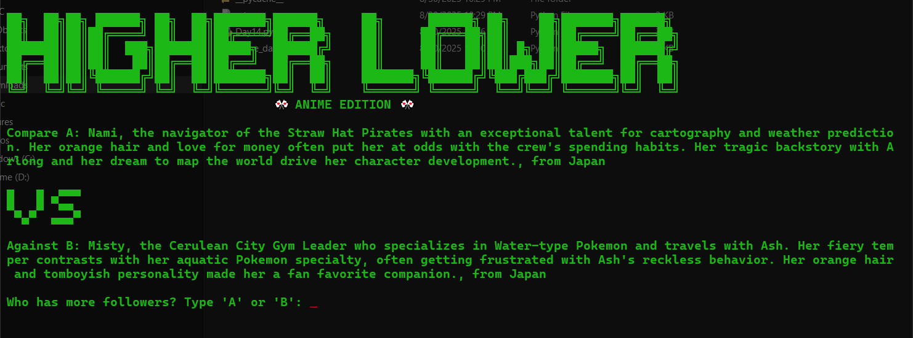

# **🎌 Day 14/100 - Anime Higher Lower Game**
### *A fun console-based guessing game featuring popular anime characters! 🎮*


### **📌 Overview**
Welcome to **Day 14** of my **#HackThePython100** journey! Today, I built an **Anime Higher Lower Game** to practice essential programming concepts like **modular programming**, **data structures**, and **user input handling**. This project helped me master working with **dictionaries**, **functions**, **loops**, and **file organization** while creating an engaging guessing game with 35+ characters!

---

### **🛠 Features**
✔️ **35+ anime characters** from popular series  
✔️ **Real follower counts** based on actual social media data  
✔️ Characters from **Date A Live**, **Sword Art Online**, **Pokemon**, **Hunter x Hunter**  
✔️ **ASCII art logo** with matching VS display 🎨  
✔️ **Clear screen function** for better gameplay  
✔️ **Input validation** to prevent errors  
✔️ **Detailed character descriptions** (2-3 lines each)  
✔️ **Play again option** for endless fun  
✔️ **Score tracking** throughout the game  
✔️ **Follower count reveals** after each guess  

---

### **🚀 How to Run**
1. **Clone the repository**  
   ```sh
   git clone https://github.com/official-imvoiid/HackThePython100.git
   cd HackThePython100/Day14
   ```
2. **Run the game**  
   ```sh
   python main.py
   ```
---

### **📂 Project Files**
- **`main.py`** → Main game logic & clear screen function  
- **`art.py`** → ASCII logo & VS art  
- **`game_data.py`** → 35+ anime characters with real follower data  
- **`HighLow.png`** → Game screenshot  

---

### **🎌 Featured Anime Series**
🔥 **Jujutsu Kaisen** - Satoru Gojo, and more  
⚡ **Dragon Ball** - Goku, Vegeta, and more  
🏴‍☠️ **One Piece** - Luffy, Nami, and more  
🍥 **Naruto** - Naruto, Hinata, Itachi, and more  
⚔️ **Attack on Titan** - Eren, Mikasa, Levi, and more  
👹 **Demon Slayer** - Tanjiro, Nezuko, and more  
📅 **Date A Live** - Tohka, Kurumi, Origami  
⚔️ **Sword Art Online** - Kirito, Asuna, Sinon  
⚡ **Pokemon** - Ash, Pikachu, Misty  
🔍 **Detective Is Already Dead** - Siesta, Kimihiko, Nagisa  
🎯 **Hunter x Hunter** - Gon, Killua, Hisoka, Kurapika  

---

### **📊 Follower Count Ranges**
- **6M+:** Global anime icons (Goku, Pikachu)  
- **3M:** Most popular characters (Gojo, Naruto, Luffy)  
- **1-2M:** Major fan favorites (Eren, Mikasa, Vegeta)  
- **500K-1M:** Popular characters (Ash, Light, Saitama)  
- **42K-310K:** Based on real anime creator data  

---

### **📢 What I Learned**
✅ **Modular programming** with separate files for data & art  
✅ **User input validation** and error handling  
✅ **ASCII art design** for engaging visuals  
✅ **Clear screen functionality** for better UX  
✅ **Random selection** without repetition  
✅ **String formatting** for clean output display  
✅ **Game loop implementation** with replay option  
✅ **Working with dictionaries** and data structures  
✅ **Import statements** and code organization  
✅ **Conditional logic** for game flow control  

---

### **🎮 How to Play**
1. **Start the game** - See two anime characters  
2. **Read descriptions** - Learn about each character's abilities & story  
3. **Make your guess** - Type 'A' or 'B' for who has more followers  
4. **See the results** - Get instant feedback with real follower counts  
5. **Keep playing** - Build your score and test your anime knowledge!  

---

### **🔧 Customization**
Want to add more characters? Simply edit `game_data.py`:
```python
{
    "name": "Your Character",
    "description": "detailed character description here...",
    "country": "Character's origin",
    "follower_count": 123456  # Real or estimated count
}
```

---

💻 **Keep coding & keep learning!**  
📅 **Day 14 complete – onto the next challenge!** 🔥

### **🌟 Support & Contributions**
🚀 If you love anime and this project, **star it on GitHub**!   