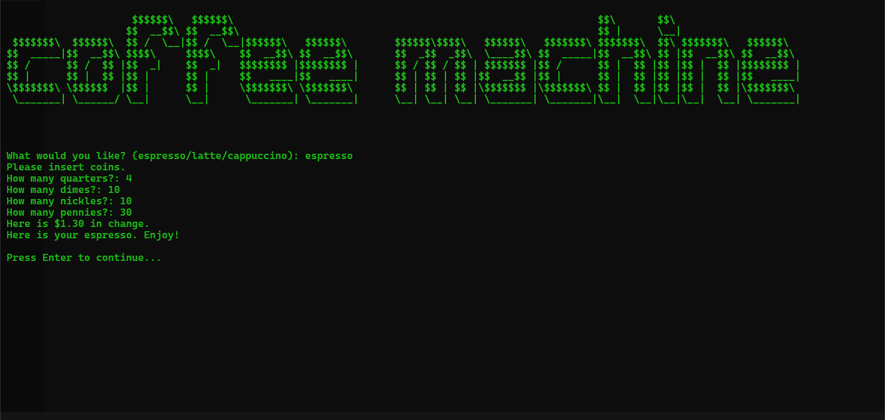

# **☕ Day 15/100 - Coffee Machine Program**
### *A fully functional coffee machine simulator with resource management & payment processing! 🎮*


### **📌 Overview**
Welcome to **Day 15** of my **#HackThePython100** journey! Today, I built a **Coffee Machine Simulator** to practice advanced programming concepts like **modular programming**, **resource management**, and **transaction processing**. This project helped me master working with **nested dictionaries**, **functions**, **while loops**.

---

### **🛠 Features**
✔️ **3 coffee types** - Espresso, Latte, and Cappuccino  
✔️ **Resource management** - Water, milk, coffee beans tracking  
✔️ **Coin payment system** - Quarters, dimes, nickles, pennies  
✔️ **Change calculation** with precise 2-decimal formatting  
✔️ **Resource reports** for maintenance mode 📊  
✔️ **ASCII art logo** with clear screen functionality 🎨  
✔️ **Input validation** and error handling  
✔️ **Transaction verification** before dispensing drinks  
✔️ **Secret admin commands** - "off" and "report"  
✔️ **Continuous operation** until manually turned off  
✔️ **Insufficient resource warnings** for better UX  
✔️ **Money refund system** for failed transactions  

---

### **🚀 How to Run**
1. **Clone the repository**  
   ```sh
   git clone https://github.com/official-imvoiid/HackThePython100.git
   cd HackThePython100/Day15
   ```
3. **Run the coffee machine**  
   ```sh
   python main.py
   ```
---

### **📂 Project Files**
- **`main.py`** → Main program with all coffee machine logic  
- **`art.py`** → ASCII coffee machine logo  
- **`CoffeeMachine.png`** → Program demonstration screenshot
- **`data.py`** → Program data
- **`ReadMe.md`** → Documentation 

---

### **☕ Coffee Menu & Pricing**
🔥 **Espresso** - $1.50 (50ml water, 18g coffee)  
🥛 **Latte** - $2.50 (200ml water, 150ml milk, 24g coffee)  
☁️ **Cappuccino** - $3.00 (250ml water, 100ml milk, 24g coffee)  

---

### **💰 Payment System**
- **Quarters** → $0.25  
- **Dimes** → $0.10  
- **Nickles** → $0.05  
- **Pennies** → $0.01  

**Example Transaction:**  
*10 quarters + 2 dimes + 1 nickel = $2.75*  
*Latte costs $2.50 → "Here is $0.25 in change."*

---

### **🔧 Resource Management**
**Initial Resources:**  
- **Water:** 300ml  
- **Milk:** 200ml  
- **Coffee:** 100g  
- **Money:** $0.00  

**After Each Purchase:** Resources automatically deduct & money adds to machine profits!

---

### **📢 What I Learned**
✅ **Complex data structures** - Nested dictionaries for menu systems  
✅ **Resource tracking** and inventory management  
✅ **Financial calculations** with precise decimal handling  
✅ **Function modularity** - Single responsibility principle  
✅ **While loop control** for continuous program operation  
✅ **Input sanitization** with `.lower()` and validation  
✅ **Boolean logic** for transaction verification  
✅ **State management** - Updating machine resources  
✅ **Error handling** for insufficient resources/payment  
✅ **User experience design** - Clear prompts and feedback  
✅ **Real-world business logic** implementation  
✅ **Code organization** and clean programming practices  

---

### **🎮 How to Use**
1. **Choose your drink** - Type 'espresso', 'latte', or 'cappuccino'  
2. **Insert coins** - Enter quantities for each coin type  
3. **Get your coffee** - Machine validates resources & payment  
4. **Admin functions** - Type 'report' for status or 'off' to shutdown  
5. **Continuous service** - Machine stays on for next customer!  

---

### **⚙️ Advanced Functions**
**Resource Checking:**
```python
def check_resources(drink):
    # Validates sufficient ingredients before processing
```

**Payment Processing:**
```python  
def process_coins():
    # Calculates total payment from coin input
```

**Transaction Validation:**
```python
def check_transaction(drink, money_inserted):
    # Verifies payment & calculates change
```

---

### **🔧 Customization**
Want to add more drinks? Simply extend the MENU dictionary:
```python
"mocha": {
    "ingredients": {
        "water": 200,
        "milk": 100,
        "coffee": 25,
        "chocolate": 15
    },
    "cost": 3.5
}
```

---

### **🎯 Challenge Requirements Met**
✅ **User prompting** with drink selection  
✅ **Machine shutdown** with "off" command  
✅ **Resource reporting** with current inventory  
✅ **Resource sufficiency** checking before preparation  
✅ **Coin processing** with accurate value calculation  
✅ **Transaction success** verification with refunds  
✅ **Coffee preparation** with resource deduction  

---

💻 **Keep coding & keep learning!**  
📅 **Day 15 complete – onto Object-Oriented Programming!** 🔥

### **🌟 Support & Contributions**
🚀 If you love this coffee machine simulation, **star it on GitHub**!